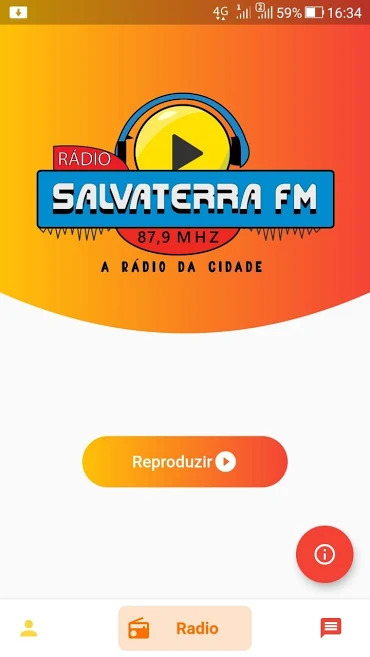

# Radio-Salvaterra-FM

Desenvolvimento de app mobile para uma rádio comunitária na cidade de Salvaterra-Marajó-PA
<h1>Dependecias utilizadas no pubspec.yaml</h1>
  
cupertino_icons: ^0.1.3

  
cloud_firestore: ^0.13.0

  
image_picker: ^0.6.2

  
google_sign_in: ^4.1.1

  
firebase_storage: ^3.1.1

  
firebase_auth: ^0.15.3

  
flutter_radio: ^0.1.8

  
shared_preferences: ^0.5.7

  
url_launcher: ^5.0.2

  
flutter_auth_buttons: ^0.8.0

  
intl: ^0.16.1

 
# Tela principal

